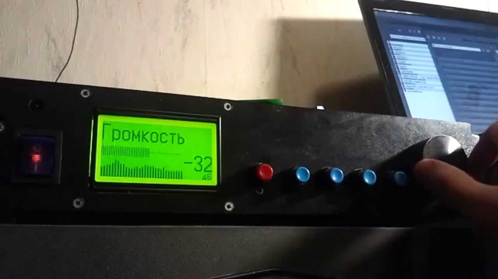

# Ampcontrol (ATmega32 / ATmega328p version)

Ampcontrol project is a control module for your DIY audio amplifier.
It supports various I²C/SPI-controlled audioprocessors and FM tuners.

Some videos related to the device can be found at
[Youtube](https://www.youtube.com/watch?v=i6dqi8C9fBk&list=PLfv57leyFFd3KTFyBgsR7_01ZDTgWIuI9&index=10)

## Main features:

- Amplifier control (mute/standby external signals)
- Digital audio control (feature set depends on used audio processor)
- 32-band spectrum analyzer (0..5kHz)
- English, Russian, Belarusian, Ukrainian and possible other localizations
- FM radio chips support / up to 50 FM stations can be saved in EEPROM
- 10 favourite FM stations support (mapped to 0..9 buttons of remote)
- RC5, RC6, NEC, Samsung remotes support with learning mode
- Nice graphics (icons and fonts) on graphic LCDs
- Alarm support (per day of week)
- Standby timer (adjustable from 2 minutes to 5 hours)
- No-signal standby timer
- Sound level meter, various modes of spectrum analyzer look'n'feel

## Supported displays:

- [KS0108 type A](files/sch/ks0108a.png) - Monochrome 128x64 graphic display with direct CS1/CS2 polarity
- [KS0108 type B](files/sch/ks0108b.png) - Monochrome 128x64 graphic display with inverted CS1/CS2 polarity
- [ST7920](files/sch/st7920.png) - Monochrome 128x64 graphic display
- [KS0066 16x2](files/sch/ks0066.png) - Monochrome alphanumeric display
- [LS020](files/sch/ls020.png) - Color 176x132 graphic display found in some Siemence mobile phones like S65
- SSD1306 - Monochrome 128x64 graphic OLED I²C (SCK - PA4, SDA - PA2)

## Supported audio processors:

- TDA7439 - 4 stereo inputs, bass, middle, treble
- TDA7312 - 4 stereo inputs, bass, treble
- TDA7313/PT2313 - 3 stereo inputs, bass, treble, fade, loudness
- TDA7314 - Stereo input, bass, treble, fade, loudness
- TDA7315 - Stereo input, bass, treble
- TDA7318 - 4 stereo inputs, bass, treble, fade
- PT2314 - 4 stereo inputs, bass, treble, loudness
- TDA7448 - 6-ch input, fade, center, subwoofer
- PT2323/PT2322 - 4 stereo inputs, 5.1 input, bass, treble, fade, center, subwoofer, surround, 3d
- TEA6300 - 3 stereo inputs, bass, treble, fade
- TEA6330 - Stereo input, bass, treble, fade
- PGA2310 - High-end stereo volume control (ATmega32 only)
- TUNER_VOLUME - Use built-in tuner (RDA580x/Si4703) volume control as audioprocessor
- R2S15904SP - 4 stereo inputs, bass, treble (found in Microlab Solo-7C) (Atmega32 only)

## Supported FM tuners

- TEA5767 - I²C FM tuner
- RDA5807 - I²C FM tuner with RDS support
- TUX032  - I²C FM tuner found in some Sony car radio
- LM7001  - SPI-controlled frequency synthesizer
- RDA5802 - I²C FM tuner
- SI470X  - I²C FM tuner with RDS support
- LC72131 - SPI-controlled frequency synthesizer

## Building the code

GNU AVR Embedded Toolchain is required to build the project.

The project build system is based on [GNU Make](https://www.gnu.org/software/make/).
Linux users must have it already installed or they can easily do it.
For Windows users there is a port exists.
In both cases, both toolchain and make binaries should be added to the system PATH.

The process of building is very simple and doesn't depend on any other software installed.

### Default build (from src/ directory of the project):

`make`

### Build for the specific MCUs, display

`make DISPLAY=SSD1306 MCU=atmega328p`

The list of supported display controllers and MCUs can be found in [Makefile](src/Makefile) or [build_all](build_all.sh) script.

## Schematics and wiring

The schematic and PCB files for the device itself can be found in [files](files) directory.

## Ampcontrol EEPROM editor

While project uses various parameters from EEPROM memory (for example, audioprocessor and tuner selection),
special desktop application to edit eeprom_xx.bin was designed. It allows to load, modify and save eeprom binary file in easy way.

Ampcontrol editor is written with Qt5 and the source code is availiable [here](editor)

## Ampcontrol remote control application

Ampcontrol remote can be used to control the device from PC. It can work via any USB-UART dongle.
TX pin of UART should be connected to RX pin of MCU. An appropriate COM port settings have to be set up.

Also, if you have Bluetooth adapter that provides COM port in the system, it also can be used to control
the device without any wires. Bun on the device side Bluetooth-to-UART bridge should be used.
HC-05 (or HC-06) module is the best choice for it. In this case Android version of application can also be used.

Remote application is also written with Qt5 and the source code can be get [here](remote).

## Useful links

- [Releases](https://github.com/WiseLord/ampcontrol/releases) of Ampcontrol firmwares and related software.
- [Youtube playlist](https://www.youtube.com/watch?v=yy9XiIlWfCc&list=PLfv57leyFFd3KTFyBgsR7_01ZDTgWIuI9) (mostly in Russian) about Ampcontrol
- [First article about the project](http://radiokot.ru/circuit/audio/other/39) (in Russian)
- [Second article about the project](http://radiokot.ru/circuit/audio/other/45) (in Russian)
- [Forum thread](http://radiokot.ru/forum/viewtopic.php?t=98758) (in Russian)
